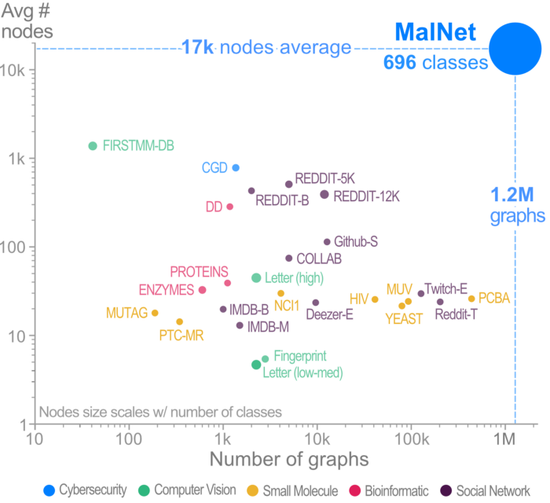
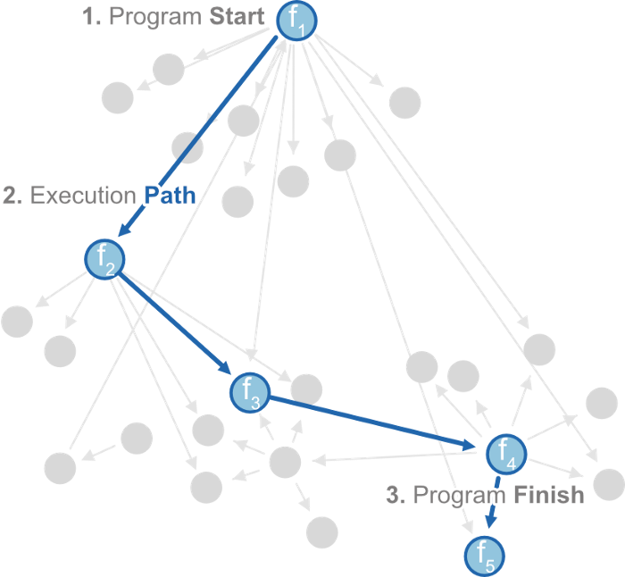

# A Large-Scale Database for Graph Representation Learning

### How do we download and explore MalNet?
We have designed and developed **[MalNet Explorer](www.mal-net.org/explore)**, an interactive graph exploration and 
visualization tool to help people easily explore the data before downloading.
Figure 3 shows MalNet Explorer’s desktop web interface and its main components. 
MalNet Explorer and the data is available online at: www.mal-net.org.

### MalNet: Advancing State-of-the-art Graph Databases
Recent research focusing on developing graph kernels, neural networks and spectral methods 
to capture graph topology has revealed a number of shortcomings of existing graph benchmark datasets, 
which often contain graphs that are relatively:

- **limited in number**,
- **small in scale** in terms of nodes and edges, and
- **restricted in class diversity**.

To solve these issues, we have been working to develop the worlds largest public graph representation 
learning database to date at Georgia Tech’s [Polo Club of Data Science](https://poloclub.github.io/).
We release **[MalNet](www.mal-net.org)**, which contains over 1.2 million function call graphs
averaging over **17k nodes** and **39k edges per graph**, across a hierarchy of 47 types and 696 families of classes (see Figure 1 below). 

Compared to the popular REDDIT-12K database, MalNet offers 105x more graphs, 44x larger graphs on average, and 63x more classes.

### What is a function call graph (FCG)?

Function call graphs represent the control flow of programs (see Figure 2 below), and can be statically extracted from 
many types of software (e.g., EXE, PE, APK). We use the Android ecosystem due to its large market share, easy 
accessibility, and diversity of malicious software.
With the generous permission of the [AndroZoo](https://androzoo.uni.lu/) we collected 1,262,024 Android APK files, 
specifically selecting APKs containing both a family and type label obtained from 
the [Euphony](https://github.com/fmind/euphony) classification structure.

### How to run the code?
The experiments we conducted in the [arXiv paper](https://arxiv.org/abs/2011.07682) can be run using dm_experiments.py.

