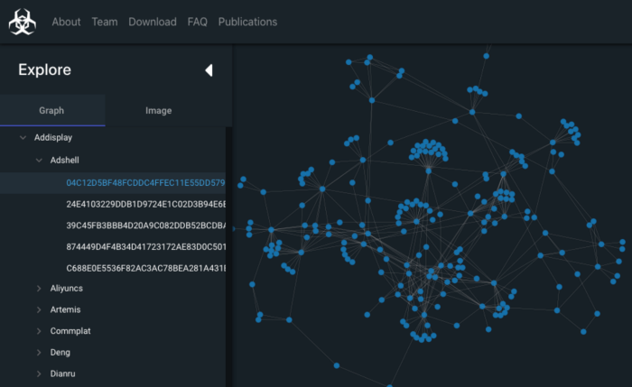

# A Large-Scale Database for Graph Representation Learning
Accepted for an oral presentation in the NeurIPS 2021 Datasets and Benchmarks Track

### MalNet: Advancing State-of-the-art Graph Databases
Recent research focusing on developing graph kernels, neural networks and spectral methods 
to capture graph topology has revealed a number of shortcomings of existing graph benchmark datasets, 
which often contain graphs that are relatively:

- **limited in number**,
- **small in scale** in terms of nodes and edges, and
- **restricted in class diversity**.

To solve these issues, we have been working to develop the worlds largest public graph representation 
learning database to date at Georgia Tech’s [Polo Club of Data Science](https://poloclub.github.io/).
We release **[MalNet](https://www.mal-net.org)**, which contains over **1.2 million function call graphs**
averaging over **17k nodes** and **39k edges per graph**, across a hierarchy of 47 types and 696 families of classes (see Figure 1 below). 

Compared to the popular REDDIT-12K database, MalNet offers 105x more graphs, 44x larger graphs on average, and 63x more classes.

### What is a function call graph (FCG)?

Function call graphs represent the control flow of programs (see Figure 2 below), and can be statically extracted from 
many types of software (e.g., EXE, PE, APK). We use the Android ecosystem due to its large market share, easy 
accessibility, and diversity of malicious software.
With the generous permission of the [AndroZoo](https://androzoo.uni.lu/) we collected 1,262,024 Android APK files, 
specifically selecting APKs containing both a family and type label obtained from 
the [Euphony](https://github.com/fmind/euphony) classification structure.

### How do we download and explore MalNet?
We have designed and developed **[MalNet Explorer](https://www.mal-net.org/explore)**, an interactive graph exploration and 
visualization tool to help people easily explore the data before downloading.
Figure 3 shows MalNet Explorer’s desktop web interface and its main components. 
MalNet Explorer and the data is available online at: www.mal-net.org.

### How to run the code?
The code is broken into 2 separate directories:
ata mining experiments and (2) graph neural network experiments.
The code for each technique can be run using 'dm_experiments.py' and 'gnn_experiments.py', respectively. 
In addition, we aggregate the key parameters for each method into the respective 'config.py' files.

Before running the code, download the data from www.mal-net.org and specify the directory to the 'full' and 'tiny' datasets
in both the dm and gnn 'config.py' files using the parameter 'malnet_dir', and 'malnet_tiny_dir', respectively.
In addition, download the split info controlling the train/val/test splits from www.mal-net.org and place it in this directory.

### Create your own FCGs
The code to extract function call graphs (FCGs) from Android APK files can be found in 'create_dataset.py'.
To run the code we need to install some legacy versions of Androguard and Networkx.
If you want to visualize the FCG, we also need to install a Linux library (otherwise, comment out the visualization code).

1. Install the following packages
   1. sudo apt install libcairo2-dev
   2. pip install androguard (note: this installs the deprecated PyPi pacakge from 2019)
   3. pip install networkx==2.3
   4. pip install joblib
   5. pip install tqdm
   6. pip install pycairo
   7. pip install igraph
2. Create a folder in your working directory called "apk_files" and add your APK files.
3. To analyze hundreds or thousands of APKs, set the number of cores to >1, up to the number of cores on your machine.
4. Run the script